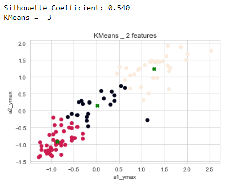

# GNT-Arai-2.31-Minh-challenge-clustering

## Bearing classification challenge

### Mission
Our mission is to make an automated bearing testing system and to create a model in order to execute in a scheduled maintenance system. 
The goal is to find the more convenient algorithm to make some predictions about this system. 

### Content

 - For the experiments device shown on the picture was constructed. Two bearings were installed on the shaft. The rotation speed changed from 0 to 1500 rpm, was held for 10 seconds, and decreased to 250 rpm. 
 - The shaft was rotated using an DC motor connected to the shaft through a coupling. A radial load of 3.5 kg is applied to the shaft using a balanced weight.
The bearings were mounted on the shaft as shown in Figure 1. 
- GY-61 ADXL3353 accelerometers were mounted on the bearing housing 
- The sensor location is also shown in Figure. 
- The recording was saved along the x, y, z axes.
##### Datasets: 
   - bearing_signals.csv. Contains signals recordings.
   - bearing_classes.csv. Classes whole or defective for every bearing.

### Credits
* Hoang Minh (@Minh6019)

### Method
Below are provided the steps that were followed for this project. Each step and classifiers have their own document.

 1. Data visualization: ploting data to detect data relations and usefulness of features

 2. Preprocessing: with the knowledge acquired with the preceding step, apply preprocessing of data including dealing with missing values, drop unuseful features and build new features
 4. Feature selection: 5 new representative features (i.e. min, max, median, std, mean) derived from the orginal features (timestamp, a1_x, a2_x, a1_y, a2_y, a1_z, a2_z, hz, w). We have 45 features.
 5. I create the following features:'timestampmin', 'timestampmax', 'timestampmean', 'timestampstd',
         'timestampmedian', 'a1_xmin', 'a1_xmax', 'a1_xmean', 'a1_xstd',
         'a1_xmedian', 'a1_ymin', 'a1_ymax', 'a1_ymean', 'a1_ystd', 'a1_ymedian',
         'a1_zmin', 'a1_zmax', 'a1_zmean', 'a1_zstd', 'a1_zmedian', 'a2_xmin',
         'a2_xmax', 'a2_xmean', 'a2_xstd', 'a2_xmedian', 'a2_ymin', 'a2_ymax',
         'a2_ymean', 'a2_ystd', 'a2_ymedian', 'a2_zmin', 'a2_zmax', 'a2_zmean',
         'a2_zstd', 'a2_zmedian', 'hzmin', 'hzmax', 'hzmean', 'hzstd',
         'hzmedian', 'wmin', 'wmax', 'wmean', 'wstd', 'wmedian', 'status'
  5. This preprocessing is finished and is ready for clustering.
  6. Clustering: build clustering based on the preprocessed data using a variety of techniques

### Classification techniques with the "inertia" and "silhouette_coeff":
1. KMeans: tested 2 **failed** features: (I do hier in manuel but it could be automated )  
    
  | Features            | Parameter  | silhouette_coeff |
  |---------------------|------------|------------------|
  |'a1_xmax','a1_xstd'	|k=2	| 0.63 	|
  |'a1_ymax', 'a2_ymax'|	k=2	|0.67 |
  |'a1_zmax', 'a2_zstd'|	k=2	|0.72 |
  |'wstd', 'wmedian'|	k=2	|0.65 |
  |'wmean', 'wstd'|	k=2	|0.67 |
  |'wmean', 'wmedian'|	k=2	|0.69 |
  |'a2_ymin', 'a2_ymax'|	k=2	|0.53 |
  |'a2_ymedian', 'a2_ystd'|	k=2	|0.48 |
  |'a2_ymean', 'a2_ystd'|	k=2	|0.78 |
  
   
  
  
  2. KMeans: tested from 3 to 6 **failed** features:
    * Based on the result of 2 **failed** features, I am going to extend to 3,4,5 and 6 **failed** features.
    * Hier is somes best plot results:
     * Ex: "3 failed" features:
     *   
     * Ex: "4 failed" features:
     * 
     * Ex: "5 failed" features:
     * 
     * Ex: "6 failed" features:
     * 
               
   3. After with the best result of 6 **failed** features, I am going to test with another models:DBSCAN, SpectralClustering and AgglomerativeClustering
     * Features: 'a1_ymean', 'a1_ymax', 'a2_ymax', 'a2_ymean', 'wstd', 'wmedian'
     
  
  #### DBSCAN:
    - Features: 'a1_ymean', 'a1_ymax', 'a2_ymax', 'a2_ymean', 'wstd', 'wmedian'
    - Estimated number of clusters: 1
    - Estimated number of noise points: 74
    - Silhouette Coefficient: 0.205
    - Automatic, no tuning
       
  #### SpectralClustering:

    - Features: 'a1_ymean', 'a1_ymax', 'a2_ymax', 'a2_ymean', 'wstd', 'wmedian'
    - Estimated number of clusters: 2
    - Estimated number of noise points: 0
    - Silhouette Coefficient: 0.390

   

  #### AgglomerativeClustering:

    - Features: 'a1_ymean', 'a1_ymax', 'a2_ymax', 'a2_ymean', 'wstd', 'wmedian'
    - Estimated number of clusters: 2
    - Estimated number of noise points: 0
    - Silhouette Coefficient: 0.728
    - Automatic, no tuning

#### Conclusion:
   - For the same 6 Features: 'a1_ymean', 'a1_ymax', 'a2_ymax', 'a2_ymean', 'wstd', 'wmedian'
   - DBSCAN proposes                  : "1 cluister" and "Silhouette Coefficient"= 0.205"
   - SpectralClustering proposes      : "2 cluisters" and "Silhouette Coefficient"= 0.39"
   - AgglomerativeClustering proposes : "2 cluisters" and "Silhouette Coefficient"= 0.728"
   - KMeans proposes                  : "4 cluisters" and "Silhouette Coefficient"= 0.50" (Elbow: k=4, inertia=150)
   - In the case of our exercise (bearing), I preferre model "KMeans" because we can controle the cost_function_Inertia and "Silhouette Coefficient" with the "tuning"
   - If we can automate the procedure to select the best "couple features", the score will be higher.
  
### Folder structures
* Contains all of the jupyter's notebooks including classifiers, preprocessing and data visualization
  | File                     | Description                                                                 |
  |--------------------------|-----------------------------------------------------------------------------|
  | plot folder            | Contains plots' images|
  | 1.challenge-classification_01.ipynb   | Python code written in "Jupyter Notebook"   Code used to get the data ready for Machine Learning.  |
  | 3.README.md           | Information on the assignment                   |  

### Installation instructions
1. Install Python and clone this repository
2. Install required Python modules with pip install -r requirements.txt
to run the jupyter's notebooks just go with jupyter notebook
